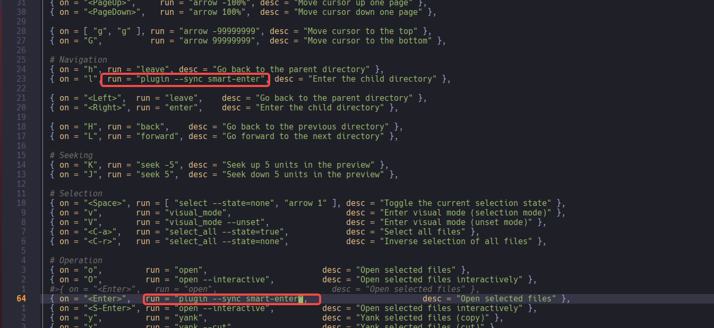
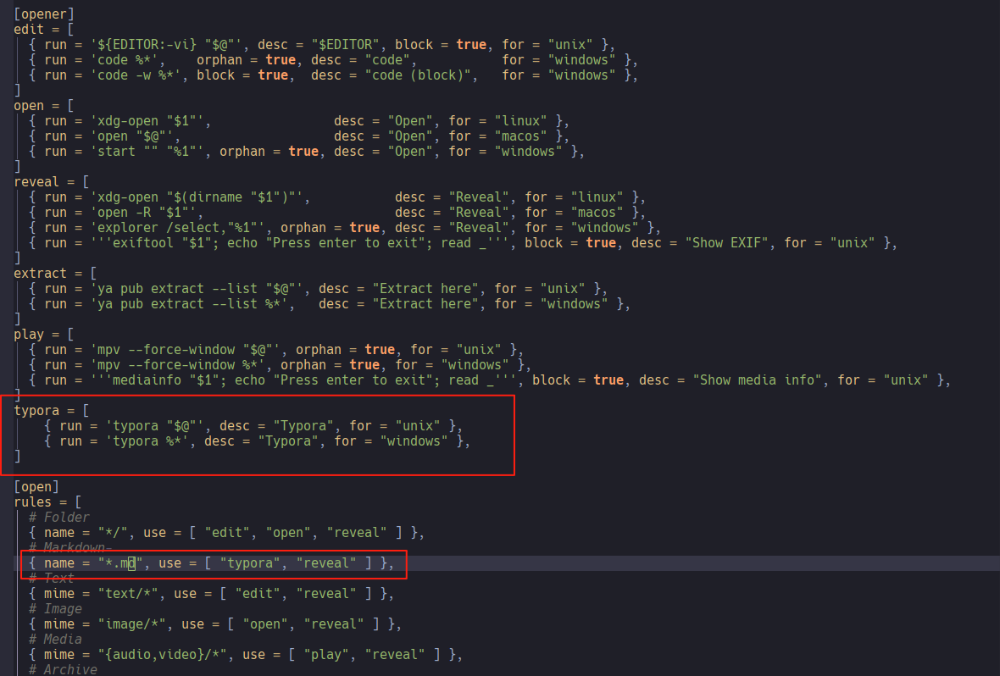

## 安装

yazi官网  https://yazi-rs.github.io/docs/installation

```bash
sudo pacman -S yazi ffmpegthumbnailer p7zip jq poppler fd ripgrep fzf zoxide imagemagick
```

这时候就可以使用yazi 命令

## yazi修改当前目录

https://yazi-rs.github.io/docs/quick-start

>  正常使用yazi访问文件夹或者文件，退出后不会修改当前目录，需要添加配置

添加配置在~/.zshrc文件中

```bash
function y() {
	local tmp="$(mktemp -t "yazi-cwd.XXXXXX")" cwd
	yazi "$@" --cwd-file="$tmp"
	if cwd="$(command cat -- "$tmp")" && [ -n "$cwd" ] && [ "$cwd" != "$PWD" ]; then
		builtin cd -- "$cwd"
	fi
	rm -f -- "$tmp"
}
```

这时候就可以使用`y`命令进入yazi，退出yazi也会修改当前目录

## yazi配置

https://yazi-rs.github.io/docs/configuration/overview

在`~/.config/yazi/`目录下添加`toml`配置文件

### 智能进入

https://yazi-rs.github.io/docs/faq#why-separate-open-enter

https://yazi-rs.github.io/docs/tips/#smart-enter

yazi的enter和open是两个函数，如果对文件按回车，就用vim打开了，体验不是很好

解决方法：

创建`~/.config/yazi/plugins/smart-enter.yazi/init.lua`文件，添加

```bash
return {
	entry = function()
		local h = cx.active.current.hovered
		ya.manager_emit(h and h.cha.is_dir and "enter" or "open", { hovered = true })
	end,
}
```

修改keymap.toml文件，把run运行的函数改了，原本是open




### 默认软件打开

> 修改./config/yazi.toml， 添加[opener]和`open rule`，这个脚本的意思大概是如果名字是.md后缀的文件，使用typora 命令打开。这样不会和默认的text/*冲突


